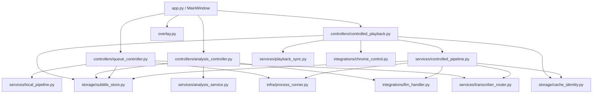

# Whisper Captioner Architecture Audit v2026-05-07

This document captures the current code structure, the main runtime flows, and the first batch of low-risk stabilization patches planned for the project.

## Scope

- Audited documents:
  - `README.md`
  - `CODE_REVIEW.md`
- Audited code modules:
  - `whisper_captioner/app.py`
  - `whisper_captioner/workers.py`
  - `whisper_captioner/cache.py`
  - `whisper_captioner/subtitle_io.py`
  - `whisper_captioner/chrome_control.py`
  - `whisper_captioner/overlay.py`
  - `whisper_captioner/llm_handler.py`
  - `whisper_captioner/models.py`
  - `whisper_captioner/config.py`
  - UI builder / panel modules

## Current Mainlines

The project now has two primary runtime flows:

### 1. Controlled URL Captions

1. Read URL from the input box, selected queue item, or current Chrome tab.
2. Canonicalize the media URL and derive a cache directory.
3. Check for manually provided `zh.*` native subtitles.
4. If `zh.*` subtitles exist, load them and start controlled playback directly.
5. Otherwise pause Chrome and check the final subtitle cache for the current pipeline signature.
6. If no valid final cache exists, download audio with `yt-dlp`.
7. Split audio into chunks and transcribe with the selected backend.
8. Run full-document LLM proofreading when configured.
9. Save final subtitle cache plus exported `.srt` and `.txt`.
10. Start controlled playback and drive the subtitle overlay from Chrome `currentTime`.

### 2. Realtime Session Captures

1. Start Loopback capture and begin 3s rolling chunk transcription (`NUCRealtimeWorker` / `RealtimeWorker`).
2. Stream segments to the floating `SubtitleOverlay` for low-latency display.
3. Persist 3s `.wav` chunks directly to a timestamped `~/Movies/WhisperCaptioner/realtime/YYYYMMDD-HHMMSS/audio/` directory.
4. On stop, concatenate all chunks into a `full-audio.wav`.
5. Save `raw-segments.json`, `manifest.json`, and initial `.srt`/`.txt` exports.
6. Trigger background LLM batch-polishing (`RealtimePolishWorker`) or full-audio re-transcription (`RealtimeReRecognizeWorker`) via the "实时回顾" UI tab.

### 3. Remote NUC ASR Coexistence

The NUC now runs two ASR lanes with explicit scheduling:

1. The app still calls `:8000` for the default/realtime `faster-whisper` lane.
2. `:8000` is now a lightweight busy-aware proxy that exposes `/health`, `/busy`, and `/v1/audio/transcriptions`.
3. The proxy forwards real `faster-whisper-server` work to the internal backend on `:18000`.
4. The optional `Qwen3-ASR 1.7B` offline lane remains app-facing on `:8001`, with its backend on `:8002`.
5. `nuc-service-scheduler` reads Docker state, GPU memory, and the `:8000/busy` signal before admitting `Qwen` work.
6. If `faster-whisper` has active requests, `Qwen` admission returns HTTP `429` so the realtime/default lane keeps priority.
7. If `Qwen` is admitted, the scheduler starts the backend on demand and the proxy schedules idle shutdown after the request window.

## Current Dependency Map

```mermaid
graph TD
    A["app.py / MainWindow"] --> B["workers.py / RealtimeWorker"]
    A --> B2["workers.py / NUCRealtimeWorker"]
    A --> C["workers.py / QueueWorker"]
    A --> D["workers.py / RollingPrefetchWorker"]
    A --> E["workers.py / LLMTextWorker"]
    A --> E2["workers.py / RealtimePolishWorker"]
    A --> E3["workers.py / RealtimeReRecognizeWorker"]
    A --> F["overlay.py / SubtitleOverlay"]
    A --> G["chrome_control.py"]
    A --> H["subtitle_io.py"]
    A --> I["cache.py"]
    A --> J["llm_handler.py"]
    A --> K["models.py"]
    A --> L["config.py"]
    A --> M["ui_builder.py"]

    C --> H
    C --> I
    C --> J
    C --> K
    C --> L

    D --> G
    D --> H
    D --> I
    D --> J
    D --> K
    D --> L

    M --> N["analysis_panel.py"]
    M --> O["transcript_panel.py"]
    M --> P["build_realtime_review_panel"]
    M --> K
```

## Module Responsibilities

### `whisper_captioner/app.py`

Current role:

- Qt main window
- UI event wiring
- controlled playback state
- worker lifecycle
- playback timer loop
- analysis task orchestration

Key observation:

- `MainWindow` currently acts as UI shell, playback controller, session manager, and analysis controller at the same time.

### `whisper_captioner/workers.py`

Current role:

- realtime whisper-stream capture
- realtime NUC Loopback capture (`NUCRealtimeWorker`)
- queue/local transcription
- controlled URL pipeline
- realtime session LLM polishing and full re-recognition (`RealtimePolishWorker`, `RealtimeReRecognizeWorker`)
- chunking strategies
- subprocess execution
- backend dispatch (local and LAN HTTP)
- final subtitle export

Key observation:

- This is the heaviest module and the best candidate for future splitting.
- The NUC remote ASR calls remain intentionally simple HTTP clients; the service coexistence policy now lives on the NUC side instead of being duplicated in the desktop app.

### `whisper_captioner/cache.py`

Current role:

- canonical media URL normalization
- cache key generation
- URL heuristics for `yt-dlp`

Key observation:

- Cache identity logic is compact and clear.
- The highest-value canonical follow-ups already landed for `youtu.be`, `youtube.com/shorts/<id>`, and `youtube.com/live/<id>`.
- Remaining follow-ups still include short-link expansion such as `b23.tv`.

### `whisper_captioner/subtitle_io.py`

Current role:

- segment JSON save/load
- SRT and VTT parsing
- SRT/TXT export

Key observation:

- `load_segments()` is a critical trust boundary.
- Basic schema validation and malformed-JSON reporting have now been added.

### `whisper_captioner/chrome_control.py`

Current role:

- Chrome AppleScript control
- playback pause/resume/seek
- silent `currentTime` polling without repeated activation

Key observation:

- The non-activating current-time read path is already a meaningful stability improvement.
- Tab identity is still URL-prefix based and remains a known risk.

### `whisper_captioner/overlay.py`

Current role:

- overlay caption rendering
- previous/current line display
- drag/resize/pin controls
- playback button signals

Key observation:

- This module is relatively self-contained and already cleaner than the orchestration layers.

### `whisper_captioner/llm_handler.py`

Current role:

- provider abstraction
- local Rapid-MLX bootstrap
- native Ollama REST API integration with think block stripping
- subtitle proofreading
- free-form analysis generation
- native/reference fusion support

Key observation:

- The provider abstraction is cleaner than expected and can remain stable while orchestration is improved elsewhere.

## Architecture Risks Worth Watching

1. `MainWindow` still owns too much business state and playback logic.
2. `QueueWorker` and `RollingPrefetchWorker` duplicate backend-specific transcription logic.
3. `RollingPrefetchWorker` is named and documented like a rolling pipeline, but the current implementation behaves closer to controlled batch processing that starts playback once final subtitles are ready.
4. Cache validation is stronger now, but cache payload formats are still split across plain segment lists and richer JSON payloads.
5. Temporary files and subprocess lifecycle cleanup are much better than before, but the code is still concentrated inside `workers.py`. The addition of multiple new realtime workers increases the surface area here.
6. Chrome tab targeting still relies on prefix matching rather than stable tab identity.
7. Remote NUC LAN inference introduces network availability risks (e.g., timeouts, connection drops) that are handled via graceful UI fallbacks, but add state complexity.
8. The NUC service layer now includes container lifecycle control. Normal Qwen idle cleanup uses stop/start semantics, but deploy/recreate scripts should continue to be reviewed carefully because they change service topology.
9. The `:8000` proxy preserves the public endpoint but adds one more hop; health checks must verify both proxy and upstream backend.

## Recommended Target Structure

## First Batch Stabilization Plan

This batch is intentionally low-risk and avoids changing controlled playback semantics.

### Patch 1: `subtitle_io.py` schema validation

Files:

- `whisper_captioner/subtitle_io.py`

Functions:

- `segment_from_dict()`
- `load_segments()`

Work:

- Validate top-level JSON is a list.
- Validate each segment is a mapping with `start`, `end`, and `text`.
- Validate numeric fields.
- Validate `end > start`.
- Raise clear errors including file path and segment index.

### Patch 2: `cache.py` canonical URL improvements

Files:

- `whisper_captioner/cache.py`

Functions:

- `canonical_media_url()`

Work:

- Normalize `youtu.be/<id>` to `watch?v=<id>`.
- Normalize `youtube.com/shorts/<id>` to `watch?v=<id>`.
- Normalize `youtube.com/live/<id>` to `watch?v=<id>`.
- Preserve current bilibili `?p=` support.

Status:

- Landed after the initial audit. The remaining canonical follow-up is still short-link expansion such as `b23.tv`.

### Patch 3: `workers.py` subprocess cleanup

Files:

- `whisper_captioner/workers.py`

Functions:

- `RealtimeWorker.stop()`
- `QueueWorker.stop()`
- `QueueWorker._run()`
- `QueueWorker._run_capture()`
- `RollingPrefetchWorker.stop()`
- `RollingPrefetchWorker._run_cmd()`
- `RollingPrefetchWorker._run_cmd_capture()`

Work:

- Add a shared process termination helper.
- Ensure `self.proc` is cleared in success, failure, and stop paths.
- Keep current throttled output behavior unchanged.

### Patch 4: `workers.py` temp file cleanup

Files:

- `whisper_captioner/workers.py`

Functions:

- `QueueWorker._process()`
- `QueueWorker._transcribe_local_qwen3_asr_chunked()`
- `QueueWorker._transcribe_local_sense_voice_cpp_chunk_series()`
- `RollingPrefetchWorker._do_rolling_prefetch()`
- `RollingPrefetchWorker._repair_sparse_chunk_with_subchunks()`

Work:

- Track job-owned temporary files explicitly.
- Clean them in `finally` blocks.
- Avoid broad temp-directory glob deletes.

### Additional Low-Risk Follow-Ups Already Landed

Files:

- `whisper_captioner/workers.py`
- `whisper_captioner/app.py`

Work:

- Clarify MLX subchunk labels in logs.
- Improve native subtitle cache load/save/fetch diagnostics.
- Improve malformed JSON reporting for:
  - final subtitle cache
  - subtitle offset cache
  - MLX term cache
- Deduplicate worker process streaming helpers.
- Deduplicate audio duration probing logic.
- Unify segment-cache load context inside `RollingPrefetchWorker`.

## File-by-File Checklist

1. `whisper_captioner/subtitle_io.py`
   - Add strict cache schema validation.
2. `whisper_captioner/cache.py`
   - Expand canonical URL handling for YouTube watch/shorts/live/youtu.be.
3. `whisper_captioner/workers.py`
   - Unify process termination and `self.proc` cleanup.
4. `whisper_captioner/workers.py`
   - Add temp file registration and cleanup for each job.
5. Verification
   - Run compile checks.
   - Validate canonical URL conversions.
   - Validate bad-cache error messages.

## Current Implementation Status

At the current project state:

- Patch 1 is complete.
- Patch 2 is complete.
- Patch 3 is complete.
- Patch 4 is complete.
- Several additional low-risk cleanup patches are also complete.

## Current Repository Packaging Status

- The repository is now tracked in git and pushed to a private GitHub repository.
- Repo-local `third_party/` is intentionally not tracked.
- Local `SenseVoice.cpp` setup is documented in `README.md` and now lives under `~/Movies/whisper-captioner_APP_Resource/third_party/` instead of being vendored into the repository.
- `.gitignore` excludes:
  - model weights and binary model artifacts
  - `.env` and key-like local files
  - build outputs and cache noise such as `dist/` and `__pycache__/`

## Completed Patch Summary

Completed in code and already pushed:

1. `subtitle_io.py`
   - Added strict segment schema validation.
   - Added malformed JSON reporting with file paths.
2. `cache.py`
   - Added canonical handling for `youtu.be`, `youtube.com/shorts/<id>`, and `youtube.com/live/<id>`.
3. `workers.py`
   - Unified subprocess termination semantics.
   - Added temp-file tracking and cleanup.
   - Clarified MLX subchunk labels.
   - Improved final subtitle cache validation and malformed-JSON reporting.
   - Improved native subtitle cache diagnostics.
   - Improved MLX term cache diagnostics.
   - Deduplicated process-streaming helpers.
   - Deduplicated audio duration probing.
   - Added a small internal cache-load helper for rolling worker paths.
4. `app.py`
   - Improved malformed-JSON reporting for subtitle offset cache loading.

## Recent Commits & Milestone Updates

Recent major features and applied commits include:

- **NUC Remote Inference Integration**: Added `nuc_asr` backend via `faster-whisper-server` and native Ollama integration over LAN.
- **Realtime Session Persistence**: Added 3s chunk saving, full audio concatenation, and `manifest.json` generation for the realtime capture flow.
- **Realtime Review & Polish**: Introduced the "实时回顾" UI tab and `RealtimePolishWorker` for batch-proofreading recorded realtime sessions.
- **Hardcode Refactoring**: Genericized Web UI model parsing to strictly mirror runtime models. Replaced absolute developer paths (`/Users/...`) with `PROJECT_ROOT` and extracted raw API ports (`8000`) into centralized config variables.
- **Working Directory Isolation**: Route selected subprocesses through `cwd=OUTPUT_DIR` so runtime garbage files (e.g., `fbank_lfr_cmvn_feature.json`) and tool side effects are isolated from the source tree without changing the app's global process working directory.
- `2decbbd` Unify segment cache load context in rolling worker
- `eb1649e` Deduplicate audio duration probing logic
- `f07f21e` Deduplicate worker process streaming helpers
- `fd9464e` Add context to native subtitle fetch failures
- `2823f1c` Clarify MLX term cache read errors
- `ebbd6f8` Clarify subtitle offset cache JSON parse errors
- `9a50432` Report final subtitle cache JSON parse errors clearly
- `af93997` Report subtitle cache JSON parse errors with file paths
- `168c59f` Clarify native subtitle cache status messages
- `73b52bf` Validate final subtitle cache segments with source paths
- `08c6b7f` Clarify MLX subchunk transcription labels
- `00c51a3` Clean up worker subprocess lifecycle and temp files

## Suggested Next Steps

The next sensible low-risk steps are:

1. Continue shrinking repeated helper patterns inside `workers.py` without changing behavior.
2. Decide whether `RollingPrefetchWorker` should remain a batch-oriented controlled pipeline or return to a true rolling playback pipeline.
3. Once behavior is frozen, start extracting:
   - a dedicated process runner
   - a transcription backend router
   - a controlled playback controller
