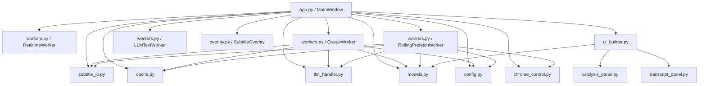
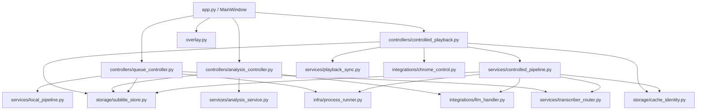

# Whisper Captioner Architecture Audit v2026-05-07

This document captures the current code structure, the main runtime flows, and the first batch of low-risk stabilization patches planned for the project.

## Scope

- Audited documents:
  - `README.md`
  - `CODE_REVIEW.md`
- Audited code modules:
  - `whisper_captioner/app.py`
  - `whisper_captioner/workers.py`
  - `whisper_captioner/cache.py`
  - `whisper_captioner/subtitle_io.py`
  - `whisper_captioner/chrome_control.py`
  - `whisper_captioner/overlay.py`
  - `whisper_captioner/llm_handler.py`
  - `whisper_captioner/models.py`
  - `whisper_captioner/config.py`
  - UI builder / panel modules

## Current Mainline

The current recommended mainline is the controlled URL captions path:

1. Read URL from the input box, selected queue item, or current Chrome tab.
2. Canonicalize the media URL and derive a cache directory.
3. Check for manually provided `zh.*` native subtitles.
4. If `zh.*` subtitles exist, load them and start controlled playback directly.
5. Otherwise pause Chrome and check the final subtitle cache for the current pipeline signature.
6. If no valid final cache exists, download audio with `yt-dlp`.
7. Split audio into chunks and transcribe with the selected backend.
8. Run full-document LLM proofreading when configured.
9. Save final subtitle cache plus exported `.srt` and `.txt`.
10. Start controlled playback and drive the subtitle overlay from Chrome `currentTime`.

## Current Dependency Map

## Module Responsibilities

### `whisper_captioner/app.py`

Current role:

- Qt main window
- UI event wiring
- controlled playback state
- worker lifecycle
- playback timer loop
- analysis task orchestration

Key observation:

- `MainWindow` currently acts as UI shell, playback controller, session manager, and analysis controller at the same time.

### `whisper_captioner/workers.py`

Current role:

- realtime whisper-stream capture
- queue/local transcription
- controlled URL pipeline
- chunking strategies
- subprocess execution
- backend dispatch
- final subtitle export

Key observation:

- This is the heaviest module and the best candidate for future splitting.

### `whisper_captioner/cache.py`

Current role:

- canonical media URL normalization
- cache key generation
- URL heuristics for `yt-dlp`

Key observation:

- Cache identity logic is compact and clear, but canonical coverage still needs follow-up for more URL forms.

### `whisper_captioner/subtitle_io.py`

Current role:

- segment JSON save/load
- SRT and VTT parsing
- SRT/TXT export

Key observation:

- `load_segments()` is a critical trust boundary and should reject malformed cache payloads early.

### `whisper_captioner/chrome_control.py`

Current role:

- Chrome AppleScript control
- playback pause/resume/seek
- silent `currentTime` polling without repeated activation

Key observation:

- The non-activating current-time read path is already a meaningful stability improvement.
- Tab identity is still URL-prefix based and remains a known risk.

### `whisper_captioner/overlay.py`

Current role:

- overlay caption rendering
- previous/current line display
- drag/resize/pin controls
- playback button signals

Key observation:

- This module is relatively self-contained and already cleaner than the orchestration layers.

### `whisper_captioner/llm_handler.py`

Current role:

- provider abstraction
- local Rapid-MLX bootstrap
- subtitle proofreading
- free-form analysis generation
- native/reference fusion support

Key observation:

- The provider abstraction is cleaner than expected and can remain stable while orchestration is improved elsewhere.

## Architecture Risks Worth Watching

1. `MainWindow` still owns too much business state and playback logic.
2. `QueueWorker` and `RollingPrefetchWorker` duplicate backend-specific transcription logic.
3. `RollingPrefetchWorker` is named and documented like a rolling pipeline, but the current implementation behaves closer to controlled batch processing that starts playback once final subtitles are ready.
4. `load_segments()` is used in multiple cache paths and needs strict validation.
5. Temporary files and subprocess lifecycle cleanup need stronger guarantees.
6. Chrome tab targeting still relies on prefix matching rather than stable tab identity.

## Recommended Target Structure

## First Batch Stabilization Plan

This batch is intentionally low-risk and avoids changing controlled playback semantics.

### Patch 1: `subtitle_io.py` schema validation

Files:

- `whisper_captioner/subtitle_io.py`

Functions:

- `segment_from_dict()`
- `load_segments()`

Work:

- Validate top-level JSON is a list.
- Validate each segment is a mapping with `start`, `end`, and `text`.
- Validate numeric fields.
- Validate `end > start`.
- Raise clear errors including file path and segment index.

### Patch 2: `cache.py` canonical URL improvements

Files:

- `whisper_captioner/cache.py`

Functions:

- `canonical_media_url()`

Work:

- Normalize `youtu.be/<id>` to `watch?v=<id>`.
- Normalize `youtube.com/shorts/<id>` to `watch?v=<id>`.
- Normalize `youtube.com/live/<id>` to `watch?v=<id>`.
- Preserve current bilibili `?p=` support.

### Patch 3: `workers.py` subprocess cleanup

Files:

- `whisper_captioner/workers.py`

Functions:

- `RealtimeWorker.stop()`
- `QueueWorker.stop()`
- `QueueWorker._run()`
- `QueueWorker._run_capture()`
- `RollingPrefetchWorker.stop()`
- `RollingPrefetchWorker._run_cmd()`
- `RollingPrefetchWorker._run_cmd_capture()`

Work:

- Add a shared process termination helper.
- Ensure `self.proc` is cleared in success, failure, and stop paths.
- Keep current throttled output behavior unchanged.

### Patch 4: `workers.py` temp file cleanup

Files:

- `whisper_captioner/workers.py`

Functions:

- `QueueWorker._process()`
- `QueueWorker._transcribe_local_qwen3_asr_chunked()`
- `QueueWorker._transcribe_local_sense_voice_cpp_chunk_series()`
- `RollingPrefetchWorker._do_rolling_prefetch()`
- `RollingPrefetchWorker._repair_sparse_chunk_with_subchunks()`

Work:

- Track job-owned temporary files explicitly.
- Clean them in `finally` blocks.
- Avoid broad temp-directory glob deletes.

## File-by-File Checklist

1. `whisper_captioner/subtitle_io.py`
   - Add strict cache schema validation.
2. `whisper_captioner/cache.py`
   - Expand canonical URL handling for YouTube watch/shorts/live/youtu.be.
3. `whisper_captioner/workers.py`
   - Unify process termination and `self.proc` cleanup.
4. `whisper_captioner/workers.py`
   - Add temp file registration and cleanup for each job.
5. Verification
   - Run compile checks.
   - Validate canonical URL conversions.
   - Validate bad-cache error messages.

## Current Implementation Status

At the time this document was written:

- Patch 1 had been started.
- Patch 2 had been started.
- Patches 3 and 4 were queued next.

